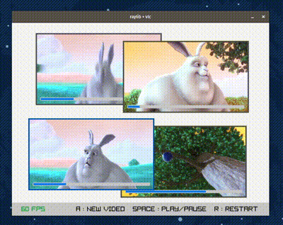

# raylib + libvlc: play videos in raylib

[](https://github.com/trikko/raylib-libvlc-example/actions/workflows/build.yml)

A minimal C example that plays videos inside a [raylib](https://github.com/raysan5/raylib) window
using [libvlc](https://www.videolan.org/vlc/libvlc.html): every format VLC can open (mp4, mkv, webm, avi, ...),
network streams and webcams, rendered to a raylib texture. Works on Linux, macOS and Windows.

I bet you have been trying to render and control a video with raylib for a long long time.
Don't you think you should at least buy me a [beer](https://paypal.me/andreafontana/5)?



## Features
 - Many videos at once, each one draggable, with play/pause, restart and seek
 - Drag & drop files on the window, or pass them on the command line
 - Streams and webcams too (see the comment in `main.c`)
 - Single C file, no engine or framework

## How it works
libvlc decodes the video on its own threads and writes each frame, already scaled, into a memory buffer
through `libvlc_video_set_callbacks()`. Frames are triple buffered: the main thread picks the latest one
and uploads it with `UpdateTexture()`, holding the lock only to swap pointers.

## How to build
 - Install [raylib](https://github.com/raysan5/raylib) 4.2 or newer. Build instructions [here](https://github.com/raysan5/raylib#build-and-installation).
 - Install libvlc 3.x and glib. On debian/ubuntu/etc.: ```sudo apt-get install libvlc-dev libglib2.0-dev```
 - Run ```make```

### macOS
With [Homebrew](https://brew.sh/). libvlc comes with VLC.app:
```
brew install pkg-config raylib glib
brew install --cask vlc
make
```
If VLC.app is not in `/Applications`, use `make VLC_DIR=/path/to/VLC.app/Contents/MacOS`.

libvlc must be told where VLC.app keeps its plugins:
```
export VLC_PLUGIN_PATH=/Applications/VLC.app/Contents/MacOS/plugins
```

### Windows
Use [MSYS2](https://www.msys2.org/). From the UCRT64 shell:
```
pacman -S make mingw-w64-ucrt-x86_64-{gcc,pkgconf,raylib,glib2,vlc}
make
```

## How to use
 - Drop one or more videos on the window, or pass them on the command line.
 - Drag a video to move it, click on its bar to seek.
 - `SPACE` play/pause, `R` restart, `C` close the video on top.

## Screenshots from CI
Taken by the automated build tests: on every push the [build workflow](.github/workflows/build.yml) builds
the example on each OS, plays two test videos and captures the screen.

| Linux | macOS | Windows |
|---|---|---|
|  |  |  |

The test videos are clips from [Big Buck Bunny](https://peach.blender.org/), (c) Blender Foundation, [CC BY 3.0](https://creativecommons.org/licenses/by/3.0/).

## See also
 - [raylib-ffmpeg-video](https://github.com/trikko/raylib-ffmpeg-video): the same with ffmpeg
